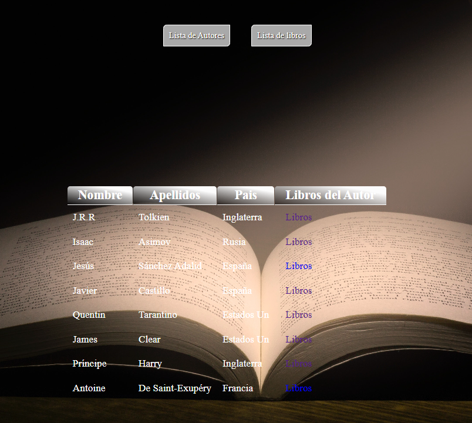

# ConsumirDatosDeApi

En este trabajo se realiza la petición a una api rest previamente creada.

Los datos son devueltos en formato JSON

La parte de la presentación de los datos...

<!--  -->

## Enlace Web

***** <a href="http://dewestarea.atwebpages.com/T7/public/" target="_blank"> Ver Resultado</a> *****
